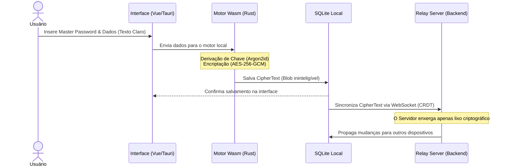

# Especificação Técnica e Planejamento: Projeto Kryptua

## 1. Visão Conceitual
**Nome do Projeto:** Kryptua
**Proposta de Valor:** "A Criptografia é Tua". Um cofre digital blindado para gerenciamento de senhas, cartões e notas seguras.
**Arquitetura Base:** Local-First e Zero-Knowledge. O servidor nunca conhece os dados em texto claro. Todas as operações de criptografia e buscas ocorrem localmente no dispositivo do cliente.
**Plataformas Alvo:** Desktop Web (via navegador) e Mobile (Android).

---

## 2. Stack Tecnológica
* **Frontend (Web & UI):** Vue 3 (Composition API) + Vite. Foco em bundles mínimos e reatividade cirúrgica.
* **Core Criptográfico:** Rust compilado para WebAssembly (Wasm). Implementação de AES-256-GCM para encriptação e Argon2id para derivação da Master Password.
* **Banco de Dados Local:** SQLite rodando no navegador via Wasm. Armazenamento persistente e buscas indexadas locais ultrarrápidas.
* **Sincronização:** CRDTs (Conflict-free Replicated Data Types) via WebSockets.
* **Backend (Relay Server):** Rust (Axum) ou Go. Atua apenas como um roteador de mensagens de sincronização e armazenamento de blobs binários.
* **Mobile (Android):** Tauri Mobile ou Capacitor. Integração com Autofill e Keystore (Biometria).
* **Infraestrutura:** Instâncias VPS ARM de alta performance (Linux), com persistência via volumes criptografados.

---

## 3. Arquitetura e Fluxo de Dados (Zero-Knowledge)

Abaixo está o diagrama do fluxo de dados demonstrando que os dados em texto claro (Plaintext) nunca deixam o dispositivo.



1. **Autenticação:** O usuário insere a Master Password.
2. **Derivação (Local):** O Wasm (Rust) deriva a chave de encriptação usando Argon2id.
3. **Desbloqueio (Local):** A chave abre o banco de dados SQLite local.
4. **Operação (Local):** O usuário adiciona uma nova credencial. O dado é criptografado pelo Wasm antes de tocar no banco local.
5. **Sincronização (Rede):** Em background, o mecanismo CRDT empacota a alteração (blob criptografado) e envia ao Backend via WebSocket.
6. **Resolução (Dispositivos):** O Backend repassa o blob para o Android. O CRDT local do Android faz o merge matemático, garantindo consistência.

---

## 4. Estrutura do Repositório (Monorepo - GitHub)
O projeto utilizará uma arquitetura polyglot unificada no GitHub, facilitando o versionamento atômico de código entre o motor criptográfico e a interface.

```text
kryptua/
│
├── .github/
│   └── workflows/      # Pipelines do GitHub Actions (CI/CD separados por path)
│
├── core-crypto/        # Código Rust (Criptografia e Wasm)
│   ├── src/
│   └── Cargo.toml
│
├── apps/
│   ├── web/            # Projeto Vue 3 + Vite (Consome o core-crypto localmente)
│   │   ├── src/
│   │   └── package.json
│   │
│   └── mobile/         # Projeto Android
│       ├── src/
│       └── package.json
│
└── relay-server/       # Backend (Roteador de WebSockets)
    ├── src/
    └── go.mod / Cargo.toml
```

---

## 5. Macro-Atividades e Tarefas

### Fase 1: Setup e Infraestrutura Base
- [ ] Configurar workspace no IDE.
- [ ] Inicializar o repositório Monorepo no GitHub.
- [ ] Configurar os fluxos (`workflows`) iniciais no GitHub Actions com triggers condicionais por pasta (ex: `paths: ['core-crypto/**']`).
- [ ] Provisionar instâncias VPS ARM (Linux) para o ambiente de desenvolvimento/testes.
- [ ] Configurar regras de DNS e redirecionamentos (`criptua.com` -> `kryptua.com`).

### Fase 2: Core Criptográfico (Rust + Wasm)
- [ ] Modelar as estruturas de dados no Rust (Vault, Item, CipherText).
- [ ] Implementar a função de derivação de chave (Argon2id) e encriptação (AES-256-GCM).
- [ ] Compilar o motor Rust para WebAssembly (`wasm-pack`).
- [ ] Criar pipeline no Actions para rodar a suíte de testes unitários do Rust a cada push.

### Fase 3: Frontend e Banco de Dados Local (Desktop Web)
- [ ] Inicializar projeto Vue 3 + Vite na pasta `apps/web`.
- [ ] Projetar a interface do usuário, otimizando layouts para uso em múltiplos monitores e leitura em orientação vertical.
- [ ] Integrar o módulo Wasm ao estado global do Vue.
- [ ] Implementar o banco de dados local com SQLite-Wasm.
- [ ] Configurar o build e o deploy automatizado da aplicação web no GitHub Actions.

### Fase 4: Sincronização e Backend
- [ ] Desenvolver a API Minimalista (Relay) na pasta `relay-server` para gerenciar WebSockets.
- [ ] Integrar o motor CRDT no cliente (Vue) e configurar a lógica de merge de dados.
- [ ] Configurar o deploy automatizado do backend na VPS ARM via GitHub Actions.

### Fase 5: Integração Mobile (Android)
- [ ] Configurar o wrapper nativo na pasta `apps/mobile`.
- [ ] Adaptar o layout Vue 3 para componentes responsivos Touch-friendly.
- [ ] Implementar integração com a API de Biometria do Android e serviço de Autofill.
- [ ] Configurar pipeline no Actions para geração automática do APK/AAB do Android.

### Fase 6: Quality Assurance (QA)
- [ ] Construir suíte de testes E2E automatizados.
- [ ] Simular ataques de injeção e manipulação de estado local.
- [ ] Realizar auditoria de performance de boot e Wasm.
